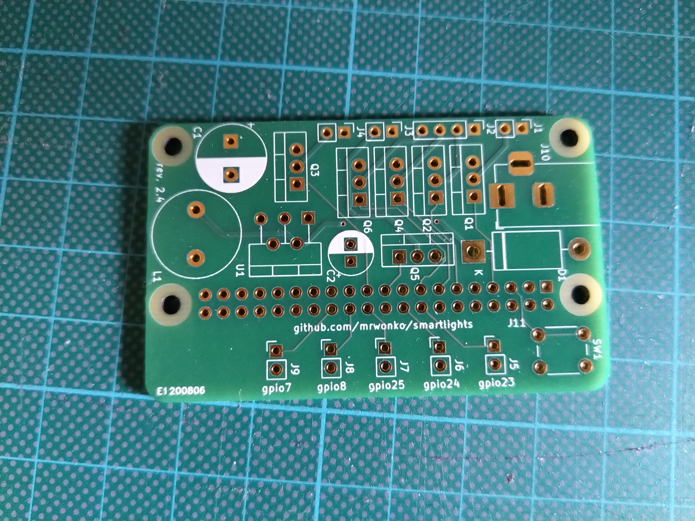

# Smart Home Intent Transmission

My S.H.I.T. Smartlights.

There's a chance you found this by coming across my hardware in real life. That'd be pretty cool.

This is an attachment for the Raspberry Pi Zero for Google Home-controlled lights. It's not technically a Pi HAT because it doesn't include the software for the Pi (that needs to be installed separately) and you're not supposed to power the Pi itself, as power is provided through this attachment. It also supports the installation of switches and comes with a power button for the Pi.

## Known Bugs

### Revision 2.4

* RGB LED strips are incorrectly assumed to share GND instead of 12V
* the transistors Q1-Q6 are wired incorrectly
* J1-J4 assume a slightly too small footprint

This can be manually patched by changing the center pin of the transistors from 12V to GND, and changing the GND on J1-J4 to 12V. To retain correct pin order on J1-J4, they also need to be installed with 180° rotation. This in turn means they slightly overlap with the transistors, unless those are installed at a slight angle.
